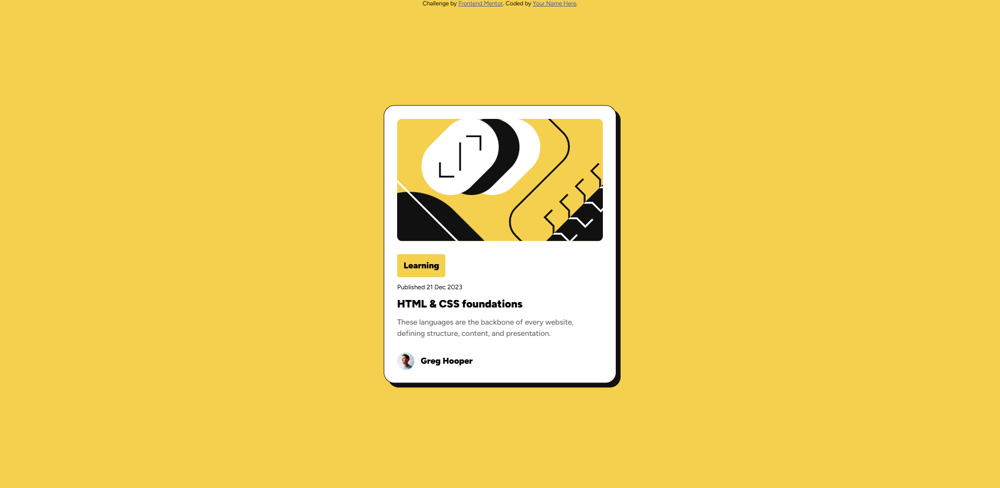

# Frontend Mentor - Blog preview card solution

This is a solution to the [Blog preview card challenge on Frontend Mentor](https://www.frontendmentor.io/challenges/blog-preview-card-ckPaj01IcS). Frontend Mentor challenges help you improve your coding skills by building realistic projects. 

## Table of contents

- [Overview](#overview)
  - [The challenge](#the-challenge)
  - [Screenshot](#screenshot)
- [My process](#my-process)
  - [Built with](#built-with)
  - [What I learned](#what-i-learned)
  - [Useful resources](#useful-resources)
- [Author](#author)

**Note: Delete this note and update the table of contents based on what sections you keep.**

## Overview

### The challenge

Users should be able to:

- See hover and focus states for all interactive elements on the page

### Screenshot

## My process

### Built with

- Semantic HTML5 markup
- CSS custom properties
- Flexbox
- Font-Face
- Desktop-first workflow

### What I learned

I learnd how to use Font-Faces.

### Useful resources

- [variable-fonts](https://web.dev/articles/variable-fonts?hl=de#variable_fonts_in_css) - How to use Font-Faces
- [Aling-Items](https://stackoverflow.com/questions/19026884/flexbox-center-horizontally-and-vertically) - I forgot how I align Items horizontal.

## Author

- Frontend Mentor - [@Akuma95](https://www.frontendmentor.io/profile/akuma95)
